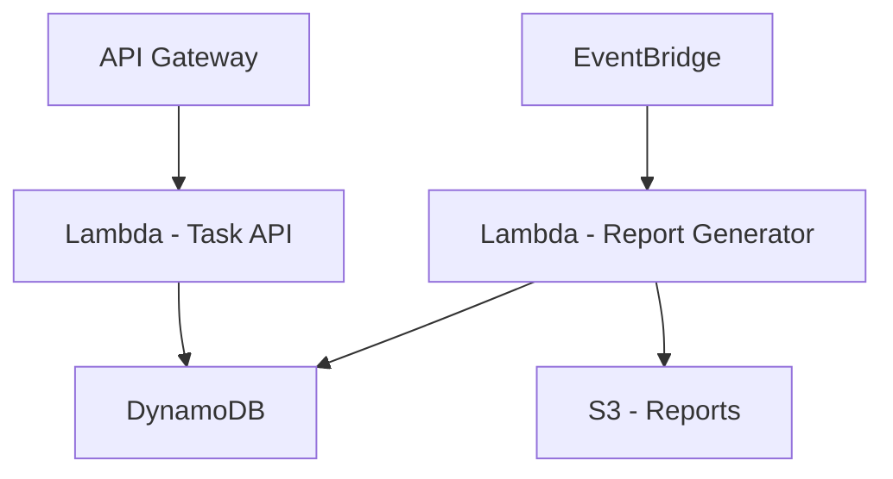

# TaskManager


TaskManager is a serverless task management system that allows users to create, update and complete tasks. Additionally, on the 1st day of each month, a PDF report is generated with various task completion metrics.

## 🚀 Tech Stack


## 📊 System Design



## Features

- **Task Management (CRUD)**: Create, update, delete, and complete tasks.
- **Monthly Report Generation**: Automatically generates a PDF report on the 1st day of each month.
- **Task Completion Metrics**:
  - List of completed tasks in the last month.
  - Average time to complete tasks.
  - The slowest and fastest completed tasks.
- **Serverless Architecture**:
  - Built with **.NET 8 Web API**.
  - Uses **AWS Lambda** for API hosting.
  - Stores data in **Amazon DynamoDB**.
  - Monthly report generation triggered by **AWS EventBridge**.
  - Reports are stored in **Amazon S3**.
- **Unit Testing**: Implemented using **NUnit**.

## Architecture

TaskManager follows a fully serverless architecture using AWS services:

1. **Task Management API**  
   - Built using **.NET 8 Web API**.  
   - Hosted as an **AWS Lambda function**.  
   - Uses **Amazon API Gateway** (if applicable) to expose endpoints.  
   - Stores task data in **Amazon DynamoDB**.  

2. **Monthly Report Generation**  
   - Triggered by **AWS EventBridge** on the 1st day of each month.  
   - Executed by a dedicated **AWS Lambda function**.  
   - Reads completed task data from **Amazon DynamoDB**.  
   - Generates a PDF report with task completion metrics.  
   - Stores the report in an **Amazon S3 bucket**.  


### Running Locally

1. Clone the repository:
   ```sh
   git clone https://github.com/Pauloocm/TaskManager.git
   cd TaskManager
