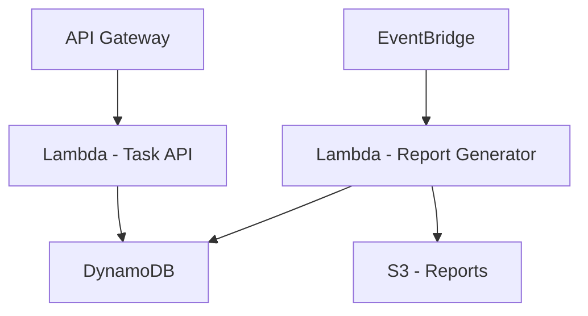

# TaskManager


TaskManager is a serverless task management system that allows users to create, update and complete tasks. Additionally, on the 1st day of each month, a PDF report is generated with various task completion metrics.

## 🚀 Tech Stack


## 📊 System Design



## Features

- **✅ Task Management (CRUD)**  
  Effortlessly manage tasks with full **Create, Read, Update, and Delete (CRUD)** operations, including the ability to mark tasks as completed.

- **📅 Automated Monthly Reports**  
  - A **PDF report** is generated automatically on the **1st day of each month**.  
  - Provides insights into task completion trends.  
  - Reports are stored in **Amazon S3**.

- **📊 Task Completion Metrics**  
  - **📜 Completed Tasks List** – View all tasks completed in the last month.  
  - **⏳ Average Completion Time** – Analyze how long tasks typically take to complete.  
  - **🚀 Fastest & 🐢 Slowest Completed Tasks** – Identify the quickest and slowest task completions.


## Architecture

TaskManager follows a fully serverless architecture using AWS services:

### 1️⃣ Task Management API  
- Built using **.NET 8 Web API**.
- Uses **Amazon API Gateway** to expose endpoints.  
- Hosted as an **AWS Lambda function** for efficient execution.   
- Stores task data in **Amazon DynamoDB** for low-latency access.  
### 2️⃣ Monthly Report Generation  
- **⏰ Automated Trigger**: Executed by **AWS EventBridge** on the **1st day of each month**.  
- **📝 Data Processing**: Reads completed task data from **Amazon DynamoDB**.  
- **📄 PDF Report Creation**: Generates a detailed report with task completion metrics.  
- **☁️ Storage & Access**: Stores the generated report securely in an **Amazon S3 bucket**.  
- **📊 Logging & Debugging**: Logs execution details and potential failures using **CloudWatch Logs** with **Serilog**, ensuring visibility into the report generation process.


### Running Locally

1. Clone the repository:
   ```sh
   git clone https://github.com/Pauloocm/TaskManager.git
   cd TaskManager

## 📸 Screenshots

Below are some images showcasing the TaskManager in action:

### Dashboard


### Task Creation


